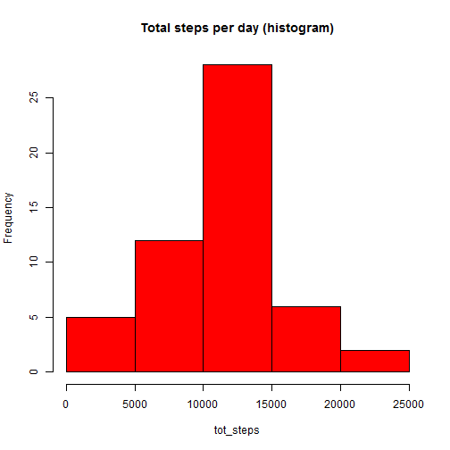
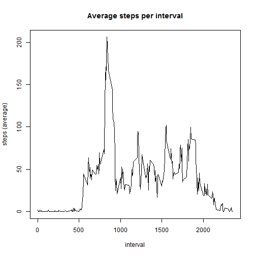
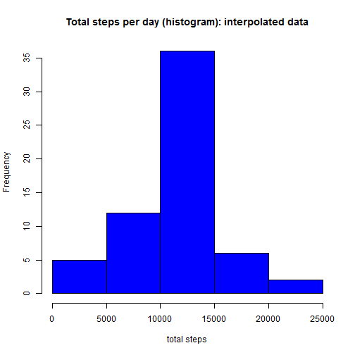
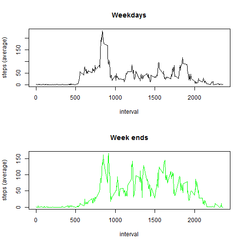

This is peer assessment 1 for the Coursera course on Reproducible research by Roger Peng.

It analyses data of an anonymous individual who used a personal activity monitoring device to record the number of steps he was taking every five minutes. 
The data was collected during October and November 2012.


## Loading and preprocessing the data

In this section we load and process the data for further analysis.

* `dataR` is the raw data. Date are cast in the proper format.
* `dataP` is the processed data with the NA rows removed.


```r
dataR<-read.csv("activity.csv")
dataR$date <-as.Date(dataR$date,"%Y-%m-%d")
dataP<-dataR[!is.na(dataR$steps),]
```


## What is mean total number of steps taken per day?

In this section, we compute the mean and median total number of steps per day.

We store in `dataD` the total number of steps per day.


```r
dataD<-aggregate(list(tot_steps = dataP$steps),list(date = dataP$date),sum)
hist(dataD$tot_steps,col='red',main="Total steps per day (histogram)", xlab="tot_steps")
```

 

```r
meanD<-mean(dataD$tot_steps)
meanD<-format(round(meanD, 2),nsmall=2)
medianD<-median(dataD$tot_steps)
```

* The **mean** total number of steps day is: **10766.19**
* The **median** is: **10765**

## What is the average daily activity pattern?

To have an insight into the daily activity pattern we average the data over the days, for each time interval.


```r
dataI<-aggregate(list(avg_steps = dataP$steps),list(interval = dataP$interval),mean)
plot(dataI$interval, dataI$avg_steps, type="l", xlab='interval', ylab = 'steps (average)', main='Average steps per interval')
```

 

```r
maxS<-max(dataI$avg_steps)
maxS<-format(round(maxS, 2),nsmall=2)
aMaxS<-dataI$interval[which.max(dataI$avg_steps)]
```

The maximum average number of steps for a 5-minute interval is 206.17. It occurs at interval **835**.


## Imputing missing values


Some results in the previous analysis can be biased due to missing data. 


```r
nMissingData<-nrow(dataR[is.na(dataR),])
```
There are **2304** missing data.

We can refine the study by replacing the missing number of steps by the average mean for this interval. The new processed data is stored in `dataQ`.


```r
dataQ<-dataR
dataQ$steps[is.na(dataR$steps)]<-dataI$avg_steps

dataQD<-aggregate(list(tot_steps = dataQ$steps),list(date = dataQ$date),sum)
hist(dataQD$tot_steps,col='blue',main="Total steps per day (histogram): interpolated data", xlab="total steps")
```

 

```r
meanQD<-mean(dataQD$tot_steps)
meanQD<-format(round(meanQD, 2),nsmall=2)
medianQD<-median(dataQD$tot_steps)
medianQD<-format(round(medianQD, 2),nsmall=2)
```

We can then draw the histogram of the total number of steps for each day.

* The **mean** total number of steps day is: **10766.19**
* The **median** is: **10766.19**

As expected, the mean before and after data interpolation is unchanged. This is because we interpolated by the mean (and because the number of interval per day is fixed).

Interestingly, the median is now equal to the mean.

Of course, the total number of steps per day increases. This can be seen by comparing the two histograms. 

## Are there differences in activity patterns between weekdays and weekends?

We pre-process the data by adding an entry to determine whether the current day is a week day or not. We then average the data over the days, by separating weekdays from week-ends.


```r
dataQI<-aggregate(list(avg_steps = dataQ$steps),list(interval = dataQ$interval),mean)
dataQ$isWeekEnd<-weekdays(dataQ$date)%in%c("Saturday","Sunday")
dataQIWe<-aggregate(list(avg_steps = dataQ[dataQ$isWeekEnd,]$steps),list(interval = dataQ[dataQ$isWeekEnd,]$interval),mean)
dataQIWd<-aggregate(list(avg_steps = dataQ[!dataQ$isWeekEnd,]$steps),list(interval = dataQ[!dataQ$isWeekEnd,]$interval),mean)

par(mfrow=c(2,1), height=1000)
```

```
## Warning in par(mfrow = c(2, 1), height = 1000): "height" is not a
## graphical parameter
```

```r
plot(dataQIWd$interval, dataQIWd$avg_steps, type="l", xlab='interval', ylab = 'steps (average)', main='Weekdays')
plot(dataQIWe$interval, dataQIWe$avg_steps, type="l", xlab='interval', ylab = 'steps (average)', main='Week ends', col='green')
```

 

As we see, the individual is much more active on week-ends, but its activity starts later than during weekdays.


